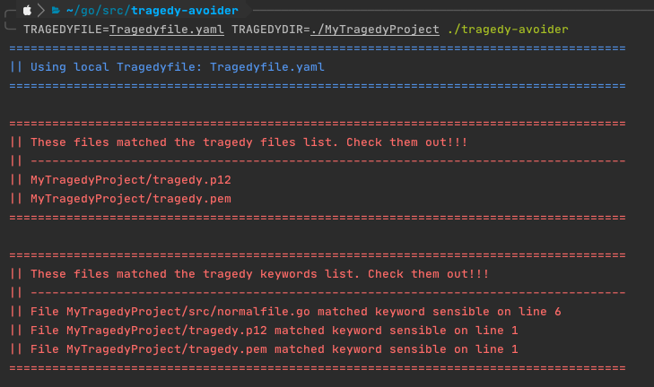
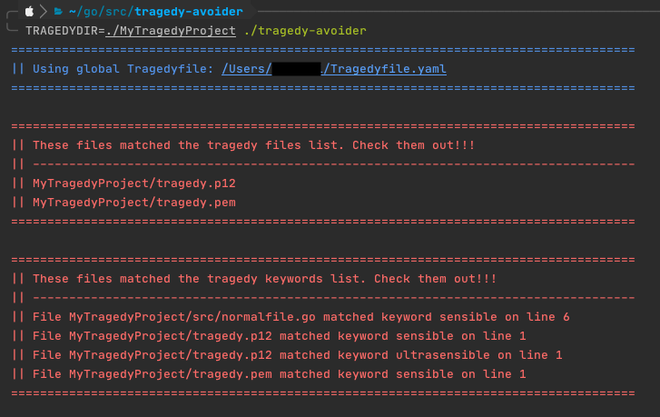

# Tragedy Avoider

## Motivation

Are you a very distracted person? Are you the kind of people that start doing things and when you realize you are doing another thing and maybe you forget what you were doing initially?
Do you feel that, sometimes, .gitignore won't be enough to save you from your(crazy)self?

I understand you!! And Tragedy Avoider is here to solve (y)our problems!!!

## What is it?
Tragedy Avoider is a directory and file crawler, that examines everything to check if a tragedy is about to happen. It's pretty simple. You define files and keywords that are risky and map them on the Tragedyfile.yaml. After that, you just run Tragedy Avoider pointing to the directory you want to examine and the Tragedyfile containing everything that worries you. You can have a Tragedyfile for each dir or a global one, it's up to you!

## How to use it?
After cloning the project, go inside the root dir:  `cd tragedy-avoider`

Here you have two options:
 1) Use the already built binary
 2) Generate your own binary after changing the source files (open source is such a wonderful thing, isn't it?)

#### The first option

So, if want to use the already built binary, you can:

Run tragedy avoider using a local Tragedyfile:

`TRAGEDYFILE=Tragedyfile.yaml TRAGEDYDIR=./MyTragedyProject ./tragedy-avoider`

If you execute it as described above, it will use the `Tragedyfile.yaml` that is inside the `tragedy-avoider` folder. 
Also, your dir target is the example dir `./MyTragedyProject`, which is also inside the `tragedy-avoider` folder.
Following these steps you will get the following result:
 

You can also run tragedy avoider using a global Tragedyfile, by running the binary as follows:

`TRAGEDYDIR=./MyTragedyProject ./tragedy-avoider `

When you omit the TRAGEDYFILE env var, it will look for a `Tragedyfile.yaml` in your user folder, like `/Users/%USER/Tragedyfile.yaml`
By running it this way, you will get the following result:

 
#### The second option
If you want to adjust something, change something, or even if you think that this thing is a total mess, and you want to rebuild it, you can change anything you want then run `go build ./avoider/tragedy-avoider.go` on the root dir. A new binary will be generated with your code, and you can use it as you wish.

#### The third(?) option 
If you chose the second option and found a way to make things better, or to improve something based on speed or anything else, please, feel free to submit a PR, I would love to learn from you!!! :D :D